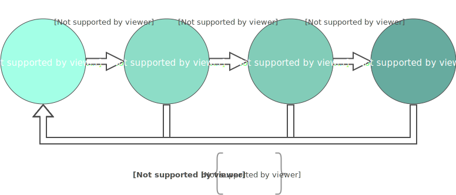

# maestro
Orchestrate groups of software-ready instances on the cloud

[//]: # (<div style="text-align:center">)


---

## TL;DR

**Base Requirements**: python2.7, virtualenv

**Installation**: `make install`

**Usage**:
1. `python maestro.py orchestra.yml instruments.yml`
2. `ansible-playbook -i inventory concerto.yml`
3. `ansible-playbook -i inventory intermezzo.yml`

**Supported cloud providers**: only *openstack*, but it's easy to extend support to other [cloud providers](#contributing).

---

# Contents
1. [What is maestro](#introduction)
2. [Why maestro](#motivation-maestro)
3. [Why ansible](#motivation-ansible)
4. [Installation](#installation)
5. [Usage](#usage)
6. [Beyond the basics](#advanced)
7. [Contributing](#contributing)
8. [License](#license)

## What is `maestro` <a name="introduction"></a>

In short, **maestro** is a wrapper for ansible. It generates an ansible inventory file and several playbooks from a description of the cluster, which is given by two input files:

1. **Orchestra** - lists groups: name of group, number of servers per group, and the hierarchy between groups (parents, children).

2. **Instruments** - lists ansible-roles to be executed by each group **(optional)**.

The output playbooks generated by **maestro** can be split into two functions:

- Create the groups of servers on the cloud

- Install and configure software (ansible roles) for one or several groups

With the generated ansible files you can now get your cluster up and running with the necessary software, faster than before, without having to write the playbook and inventory files yourself.

## Why `maestro` <a name="motivation-maestro"></a>

### When disaster strikes

Your very own first cluster. Maybe it was born out of necessity, maybe you were just curious, maybe you were bored or your boss told you to. Regardless of why and when it happened, it was probably a painful (but rewarding) experience. If the why was important however, watching it crumble and disappear into oblivion might have been an even more painful experience. Independently of whose fault that was (`insert scapegoat's name here`), you probably had to do it all over again. And then you might have realised that you don't remember exactly how you did it and which particular piece of software was installed in this machine or that machine. If only there was a magic redo button. Hopefully **maestro** is a step forward in that direction.

### Reproducible Cluster

There is no doubt that *Reproducible Research* is a good thing. However, when it's unfeasible to execute your, or someone else's, research pipeline on a single computer, there is an extra set of dependencies that adds up on top of existing ones (data and software dependencies). These are dependencies on computing resources: processing power, storage, networking. Whether you like it or not, you may need to spin up a cluster of cloud instances, or use an existing one, to run those reproducible experiments. Having an easy way to describe and re-create the computing resources necessary to run an experiment may come a long way in facilitating *Reproducible Research*.

### *Because it's faster*

But if the reasons above are not sufficient to use **maestro**, or the underlying orchestration tools (ansible), then *because it's faster* should be a good enough reason. These and similar tools (e.g. puppet, chef, juju, saltstack) enable you to get a cluster up and running much quicker than you would otherwise.

## Why `ansible` <a name="motivation-ansible"></a>

### Group it to win it

Software systems can be structured in a number of different ways. To reduce complexity we often apply principles such as separation of concerns and create notable architectural patterns. When your system is relatively small, or in development stages, it may be ok to run all of its components on a single machine. However, when your system is deployed on the cloud, or needs to scale across several machines, it's not uncommon to have one or more servers dedicated to handling each component individually. One definitely very common setup is to split your servers into several groups:

- Databases - they store your data (e.g. MySql, MongoDB, Neo4j, Cassandra)
- Computing - they handle business logic, run your analytics/research pipeline, make pancakes (e.g. hadoop/spark cluster, your hello world program)
- Webservers - they expose your website, results, work to the world or company (e.g. apache, nginx, shiny)

And these groups have quite distinct software dependencies. For example, modern database systems use client-server models to decouple the components necessary to run the database daemon, from the ones necessary to query and interact with the database. *Database* servers can therefore install server-side libraries, whilst *Computing* and *Webservers* only need much lighter client-side libraries in order to interact with the database.

I found that ansible makes it easier to address servers by functionality. The inventory file lists servers and defines hierarchies among groups. This feature is extremely useful and fits naturally when setting up or managing your cluster(s). You may choose to have one or more servers per group. To have servers belong to several groups. To have groups within other groups. Or choose not to. It's up to you.

### In a Galaxy not that far away

[Ansible Galaxy](https://galaxy.ansible.com/) is one of the best things about ansible. You can easily reuse content developed and thoroughly tested by other users. In addition to ansible's extensive list of native modules, Ansible Galaxy provides access to a whole new set of ansible roles for installing, configuring and deploying all kinds of software. Building **maestro** on top of ansible means that you get all the benefits of Ansible Galaxy.

### To learn or not to learn `ansible`

But why do I need **maestro**? Why don't I just learn and use ansible directly then? Or a different orchestration tool for that matter? You should learn ansible. And you're using ansible when working with **maestro**. What I noticed when using ansible is that a lot of playbooks end up with similar structure. I worked out what how to replicate this structure automatically to avoid brainless copy-pasting. What **maestro** does is to generate the files necessary to let ansible setup your cluster. User input is still necessary, but you don't have to write the ansible playbooks or the hosts inventory file yourself. So, you don't have to know ansible to the same extent that an experienced user has in order to use maestro and setup your cluster on the cloud. In fact, knowing ansible is not a requirement for basic usage (and I've tried to make it that way as much as possible). However, it certainty helps that you know or at least understand the main concepts behind ansible. When you start writing your own roles, learning ansible will become inevitable. At the end of the day, **maestro** is just a wrapper for ansible. Hopefully, a useful one.

## Installation <a name="installation"></a>

**maestro** is implemented and tested only in python2.7.
Installing **maestro** should be pretty straightforward whether you use the available Makefile or not.

**Not** using the `Makefile`:

0. Install python2.7 and virtualenv
1. Create virtualenv:
```
python2.7 -m virtualenv ENV
```
2. Install required python modules:
```
pip install -r requirements.txt
```
3. (optional) Install recommended ansible galaxy roles - a list which you can extend:
```
ansible-galaxy install -r supplementary-roles.yml
```

And if you're using the `Makefile` instead, all you need to do is `make install`. And that's it really. To be honest the makefile doesn't automate much here, but it can be useful nonetheless. Beware however that the makefile runs all of the steps above: 1 through 3 and hence creates the virtualenv and install the supplementary ansible roles for you.


## Usage <a name="usage"></a>

Everytime you use **maestro** don't forget first to:

1. Activate your virtualenv: 'source VIRTUALENV/bin/activate'
2. Set cloud provider's environment variables. In openstack this is done by sourcing the [RC file](https://docs.openstack.org/newton/install-guide-rdo/keystone-openrc.html).

**maestro** is typically used in the following fashion:



This means that you don't have to know a priori what your cluster looks like, that is, number of groups and number of servers per group. You can modify the description of your cluster as you go along and gain a better understanding of the requirements of your application. All you have to do is re-run `maestro.py` and the following steps if necessary. Ansible is great to guarantee the idempotency of operations and I've tried to enforce this. As an example, if you try to create a server on the cloud that already exists (matches by name) then the playbook simply skips that tasks.

Below is a list of the files that you are more likely to interact with when using maestro:

| Filename                    | Type              | Description |
| --------                    | ------------      | ----------- |
| maestro.py                  | Python Executable | Main executable - Generates Output files given Input files |
| orchestra.yml               | Input - Yaml      | Description of groups |
| instruments.yml             | Input - Yaml      | Description of roles and variables per group |
| inventory/hosts             | Output - INI      | Ansible inventory file - list of groups |
| playbooks/concerto.yml      | Output - Playbook | Playbook for booting servers on the cloud |
| playbooks/group/*           | Output - Playbook | Individual group playbooks |
| playbooks/intermezzo.yml    | Output - Playbook | Playbook for all groups |
| group_vars/*                | Output - Yaml     | Individual group variables |
| playbooks/create-server.yml | Playbook          | (EXTRA) Static playbook for creating a single server |
| playbooks/setup-image.yml   | Playbook          | (EXTRA) Static playbook for setting up a cloud image |
| inventory/openstack.py      | Python Executable | Dynamic inventory file provided by ansible for Openstack |
| maestro/*                   | Python files      | Source code and tests for *maestro.py* |

Let's look at some of these in more detail.

### `maestro.py`

```
Usage: maestro.py [OPTIONS] ORCHESTRA [INSTRUMENTS]

Options:
  --stage [openstack]  Name of target cloud provider
  --username TEXT      Default value of ansible_ssh_user. The username for the
                       host machines.
  --help               Show this message and exit.
```

Example:

```
python maestro.py \
    --stage openstack \
    --username geronimo \
    orchestra.yml \
    instruments.yml
```

See table above for information on generated output files.

### `orchestra.yml`

The first of two inputs

```

```

### `instruments.yml`

### `inventory/hosts`

### `playbooks/concerto.yml`

### `playbooks/intermezzo.yml`

### `Makefile`

## Beyond the basics <a name="advanced"></a>

. Whenever we modify the *orchestra* or *instruments* we need to re-execute **maestro**.

### Patterns

### Redefining defaults

### Supplementary roles

### Writing your own roles

### Cloud providers

### Versioning your cluster


Vars for:
  - setup_image
  - create_server

Can be specified:
  - In the roles file
  - By creating a new directory 'vars' in the roles directory and populating 'main.yml'
  - Changing the variables at 'playbooks/roles/ROLE_NAME/defaults/main.yml' - although this affects every

## Contributing <a name="contributing"></a>

## License <a name="license"></a>
